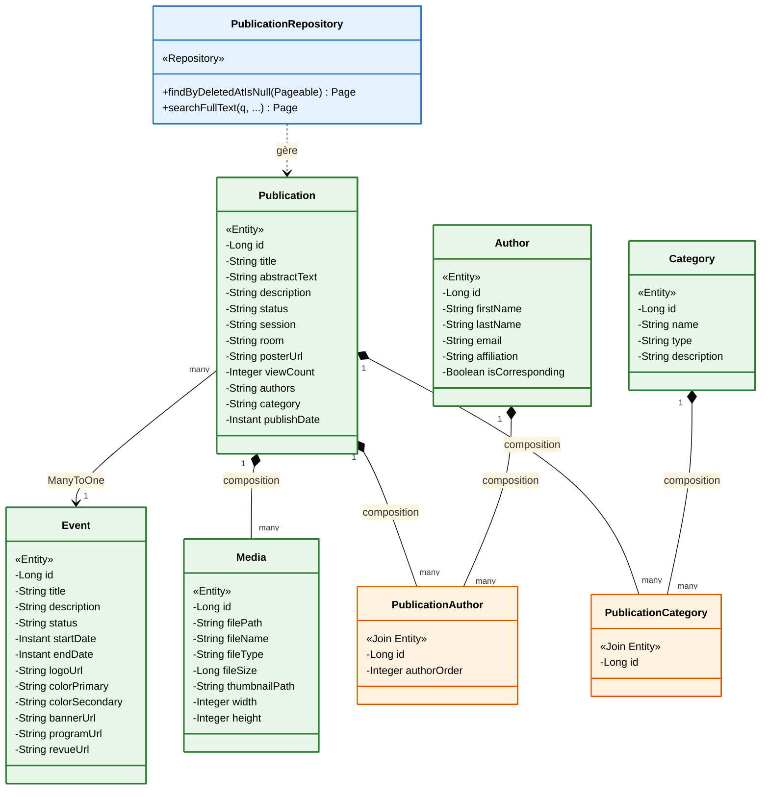
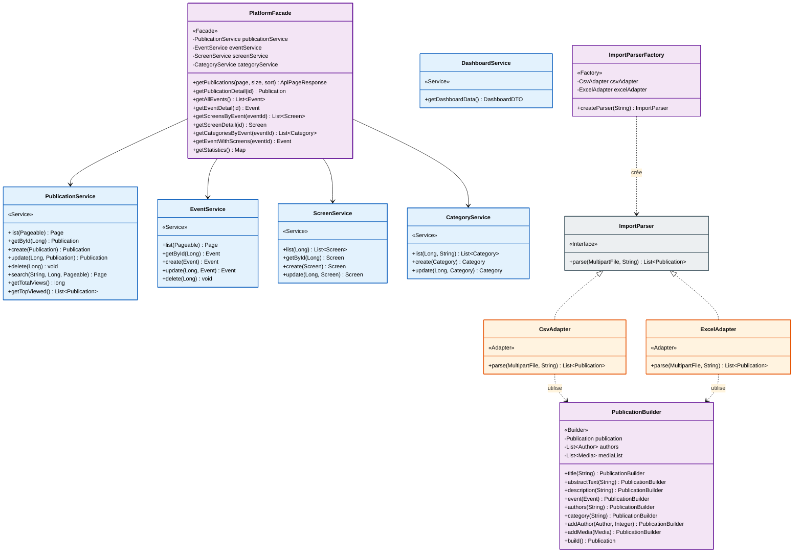
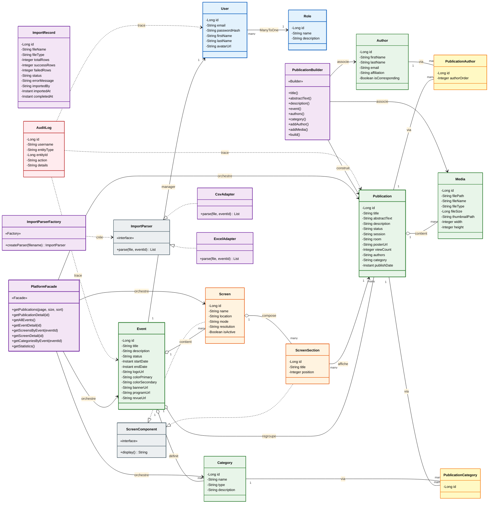
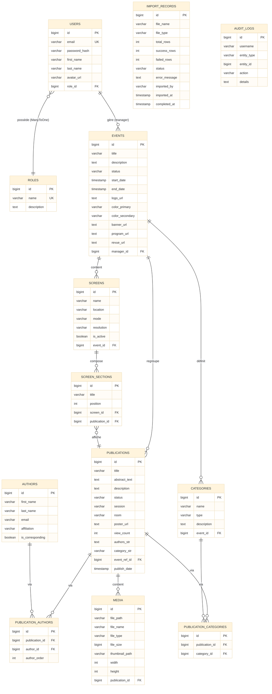
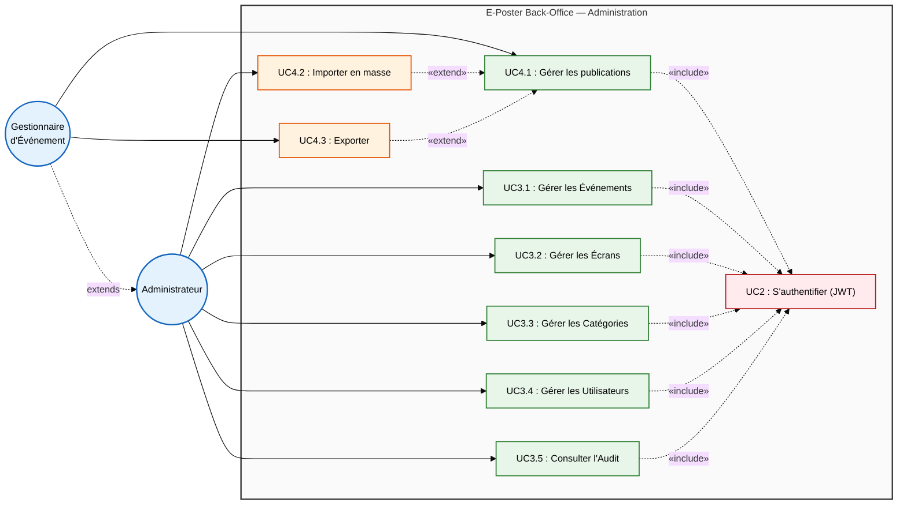
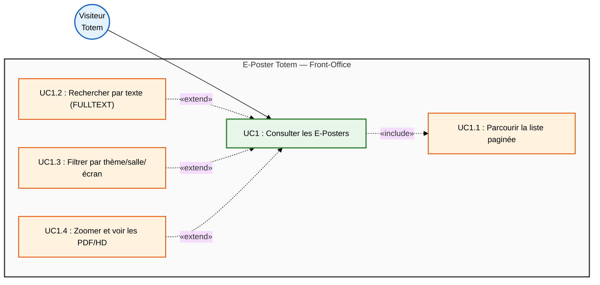

# Diagrammes UML corrigés — E-Poster Platform

> Chaque bloc `mermaid` est un diagramme indépendant à copier sur https://mermaid.live

---

## 1. Diagramme de classes — Couche Modèle & Données



---

## 2. Diagramme de classes — Couche Service (Patterns)



---

## 3. Diagramme de classes — Couche Présentation

```mermaid
%%{init: {'theme': 'base', 'themeVariables': {'fontSize': '14px'}}}%%
classDiagram
    direction TB

    class React_PublicationsAdmin {
        «View»
        -String q
        -int page
        +onSubmit(values)
        +handleFileUpload(e)
        +exportCSV()
    }

    class React_Home {
        «View»
        -Long activeEventId
        -String searchQuery
        +renderTotemGrid()
        +onSelectPoster(id)
    }

    class AuthController {
        «Controller»
        +login(req) ResponseEntity
        +register(req) ResponseEntity
    }

    class UserController {
        «Controller»
        +list() List~User~
        +create(user) User
        +update(id, user) User
        +delete(id) void
    }

    class PublicationController {
        «Controller»
        +list(page, size, sort) ApiPageResponse
        +search(q, eventId) Page
        +getDetail(id) Publication
        +create(p) Publication
        +update(id, p) Publication
        +delete(id) void
    }

    class PublicationImportController {
        «Controller»
        +importPublications(file, eventId) ResponseEntity
    }

    class EventController {
        «Controller»
        +list() List~Event~
        +getDetail(id) Event
        +create(event) Event
        +update(id, event) Event
        +delete(id) void
    }

    class ScreenController {
        «Controller»
        +list(eventId) List~Screen~
        +create(screen) Screen
        +update(id, screen) Screen
    }

    class CategoryController {
        «Controller»
        +list(eventId) List~Category~
        +create(cat) Category
        +update(id, cat) Category
    }

    class PlatformFacadeController {
        «Controller»
        +getEventBranding(eventId) ResponseEntity
        +getScreensAndCategories(eventId) ResponseEntity
    }

    class DashboardController {
        «Controller»
        +getDashboard() DashboardDTO
    }

    class AdminController {
        «Controller»
        +getAdminData() Map
    }

    %% Relations
    React_PublicationsAdmin ..> PublicationController : HTTP
    React_PublicationsAdmin ..> PublicationImportController : HTTP
    React_Home ..> PlatformFacadeController : HTTP

    style React_PublicationsAdmin fill:#E8EAF6,stroke:#283593,stroke-width:1.5px,color:#000
    style React_Home fill:#E8EAF6,stroke:#283593,stroke-width:1.5px,color:#000
    style AuthController fill:#FCE4EC,stroke:#AD1457,stroke-width:1.5px,color:#000
    style UserController fill:#FCE4EC,stroke:#AD1457,stroke-width:1.5px,color:#000
    style PublicationController fill:#FCE4EC,stroke:#AD1457,stroke-width:1.5px,color:#000
    style PublicationImportController fill:#FCE4EC,stroke:#AD1457,stroke-width:1.5px,color:#000
    style EventController fill:#FCE4EC,stroke:#AD1457,stroke-width:1.5px,color:#000
    style ScreenController fill:#FCE4EC,stroke:#AD1457,stroke-width:1.5px,color:#000
    style CategoryController fill:#FCE4EC,stroke:#AD1457,stroke-width:1.5px,color:#000
    style PlatformFacadeController fill:#FCE4EC,stroke:#AD1457,stroke-width:1.5px,color:#000
    style DashboardController fill:#FCE4EC,stroke:#AD1457,stroke-width:1.5px,color:#000
    style AdminController fill:#FCE4EC,stroke:#AD1457,stroke-width:1.5px,color:#000
```



---

## 4. Diagramme UML complet — Toutes les classes



---

## 5. Diagramme Entité-Relation (ER)



---

## 6. Cas d'utilisation — Administration Back-Office



---

## 7. Cas d'utilisation — Totem Front-Office



---

## 8. Diagramme de séquence — Phase 1 : Extraction (Import)

```mermaid
%%{init: {'theme': 'base', 'themeVariables': {'fontSize': '13px'}, 'sequence': {'mirrorActors': false}}}}%%
sequenceDiagram
    actor Admin as Administrateur
    participant View as Vue: PublicationsAdmin
    participant Ctrl as Contrôleur: PublicationImportCtrl
    participant Factory as Fabrique: ImportParserFactory
    participant Adapter as Adaptateur: ExcelAdapter
    participant Builder as Concepteur: PublicationBuilder

    Admin->>View: 1. Choisir fichier (.xlsx) & Importer
    View->>Ctrl: 2. POST /api/publications/import (file) [JWT]
    Ctrl->>Factory: 3. createParser("congres.xlsx")
    Factory-->>Ctrl: 4. ExcelAdapter

    Ctrl->>Adapter: 5. parse(file, eventId)

    loop Pour chaque ligne Excel
        Adapter->>Builder: 6. new PublicationBuilder()
        Adapter->>Builder: 7. title().abstractText().posterUrl()
        Adapter->>Builder: 8. authors().category().session()
        Builder-->>Adapter: 9. build() → Publication instance
    end

    Adapter-->>Ctrl: 10. List of Publication
    Ctrl-->>View: 11. HTTP 200 OK (Bilan de l'import)
    View-->>Admin: 12. Afficher le bilan

    style Admin fill:#E3F2FD,stroke:#1565C0,color:#000
    style View fill:#E8EAF6,stroke:#283593,color:#000
    style Ctrl fill:#FCE4EC,stroke:#AD1457,color:#000
    style Factory fill:#F3E5F5,stroke:#6A1B9A,color:#000
    style Adapter fill:#FFF3E0,stroke:#E65100,color:#000
    style Builder fill:#F3E5F5,stroke:#6A1B9A,color:#000
```

---

## 9. Diagramme de séquence — Phase 2 : Persistance & Audit (Import)

```mermaid
%%{init: {'theme': 'base', 'themeVariables': {'fontSize': '13px'}, 'sequence': {'mirrorActors': false}}}}%%
sequenceDiagram
    participant Ctrl as Contrôleur: PublicationImportCtrl
    participant Service as Service: PublicationService
    participant Repo as Dépôt: PublicationRepository
    participant Audit as Service: AuditService
    participant DB as Base MySQL

    Ctrl->>Ctrl: 1. Déclenche la persistance de la liste

    loop Pour chaque Publication extraite
        Ctrl->>Service: 2. create(publication)
        Service->>Service: 3. processRelations() (liaison Auteurs/Thèmes)

        Service->>Repo: 4. save(publication)
        Repo->>DB: 5. INSERT INTO publications
        DB-->>Repo: 6. publication (avec ID)
        Repo-->>Service: 7. publication persistée

        Service->>Audit: 8. log("PUBLICATION", id, "CREATE", title)
        Audit->>DB: 9. INSERT INTO audit_logs
        DB-->>Audit: 10. persisté
        Audit-->>Service: 11. OK

        Service-->>Ctrl: 12. OK
    end

    Ctrl->>Ctrl: 13. Fin de la transaction globale

    style Ctrl fill:#FCE4EC,stroke:#AD1457,color:#000
    style Service fill:#E3F2FD,stroke:#1565C0,color:#000
    style Repo fill:#E8F5E9,stroke:#2E7D32,color:#000
    style Audit fill:#FFEBEE,stroke:#B71C1C,color:#000
    style DB fill:#ECEFF1,stroke:#455A64,color:#000
```
